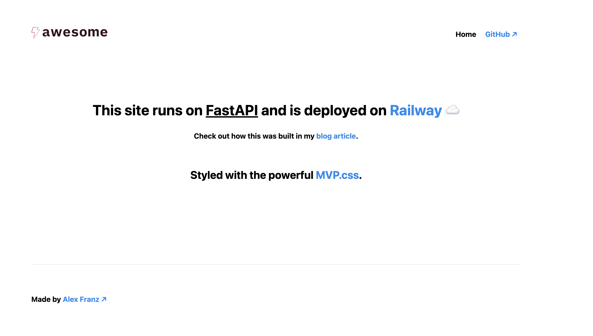

<h1>Container PaaS Comparison</h1>

A simple FastAPI app I deployed to different container PaaS providers to compare them.

Check out the live demo here, hosted with [Railway.app](https://paas-comparison-production.up.railway.app/)

---

I compared these platforms:

- [x] [Render](https://render.com/)
- [x] [Fly.io](https://fly.io/)
- [x] [Railway](https://railway.app/)

Read about it on [my blog](https://alexfranz.com/posts/deploying-container-apps-2024).
